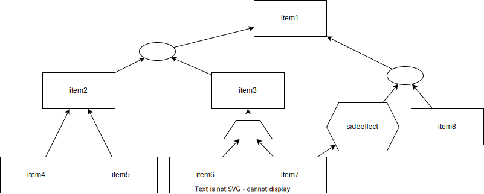
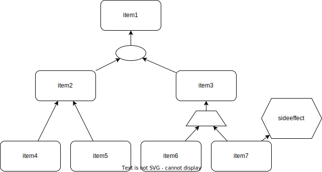

#project #github 

**Purpose**:: avoid double work (manage list and graphical representation)

## Functional requirements

- [ ] Automatically creates/updates drawio file with dependency tree basing on list
	- [ ] Produce svg xml
		- [ ] Use svg file name from code block
			- [ ] Read svg file name from code block
		- [ ] Serialize objects to xml
			- [ ] Define list of minimal required elements of xml
				- [ ] Blocks
					- [ ] Rectangle
					- [ ] Oval
					- [ ] Trapezoid
					- [ ] Hexagon
					- [ ] Rounded rectangle
				- [ ] Directed arrow
			- [ ] Calculate canvas size
				- [ ] Arrange blocks on canvas
					- [ ] Create objects basing on note's list
						- [x] Read list from note (MD) ^readmdlist
- [ ] Represent list without any service data
	- [ ] Hide service data for each line
		- [ ] Define how to distinguish service data
- [ ] Allows to specify that items should be considered as
	- [ ] alternative
		- [ ] Display branches of items by different font colors
			- [ ] Change font color within the list [^1]
	- [ ] mutually reinforced
		- [ ] append group icon for all such items
	- [ ] produce consequence all together only (by default)
- [ ] Includes `sideeffect`
- [ ] Allows reuse label's text (Represented by single node on diagram)
- [ ] Display error message in case of:
	- [ ] Invalid list elements
		- [ ] Validate source list
			- [ ] Read list from note (MD) ^readmdlist
			
## Non functional requirements

- [ ] Work with standard MD lists
- [ ] Apply MIT license
- [ ] Publish Plug-In
	- [ ] Introduce tests
		- [ ] Remove extra
			- [ ] Code
			- [ ] Settings
			- [ ] Imports
		- [ ] Create usage guideline

[Drawio Obsidian Plug-In](https://github.com/zapthedingbat/drawio-obsidian)

## Examples

```example
uid:DependencyTreeExample2
type:future
- item1
	- item2
		- item4
		- OR
		- item5
	- item3
		- item6
		- PLUS
		- item7
			- SIDEEFFECT
				- sideeffect
```

Should be presented graphically as:



Should be presented as text as:
- [ ] item1
	- [ ] item2
		- [ ] item4
		- OR
		- [ ] item5
	- [ ] item3
		- [ ] item6
		- PLUS
		- [ ] item7
			- SIDEEFFECT
				- sideeffect ^test
	- OR
	- ^ctest
	- [ ] item8

- [ ] Redesign examples (source code) must be redesigned!

```example
uid:DependecyTreeExample1
type:current
[item1]<-(join1)
(join1)<-[item2]
(join1)<-[item3]
[item2]<-[item4]
[item2]<-[item5]
[item3]<-(enhance1)
(enhance1)<-[item6]
(enhance1)<-[item7]
<sideeffect><-[item7]
```

Should be presented as:



## Used materials

- [Editors in Obsidian](https://marcus.se.net/obsidian-plugin-docs/editor)
- [Obsidian plugin API does not support rendering of embeds?](https://forum.obsidian.md/t/obsidian-plugin-api-does-not-support-rendering-of-embeds/24617/2)

---
[^1]: would be good to colorize related blocks on diagram as well